# Web-Mini-Project
#Web Mini Project, Group Number 4 , Mentor : Prof. Shiv Negi

# Edulib

## What is Edulib?
* An Open Educational Resource
* A free online educational platform for I.T students that contains curated content only based on the Mumbai University(MU) syllabus

###

|               Features                   | 
|------------------------------------------|
| Includes wide range of materials         | 
| Contains content Evaluated by Evaluators |
| Evaluate effectiveness of OER by reviews |

## Technologies Used :
* Vscode
* React Js
* MongoDB 6.0
* Express Js
* Node Js
* TinyMCE Editor

###
Team Members - 

Prakhar Sharma : https://github.com/Prakhar29Sharma

Dhaneshwari Tendle : https://github.com/dhaneshwaritendle

Sraina Panchangam : https://github.com/PSraina

<h2 id="snip">UI-Snippets</h2>
<h3 id = "landing_header">Home page</h3>
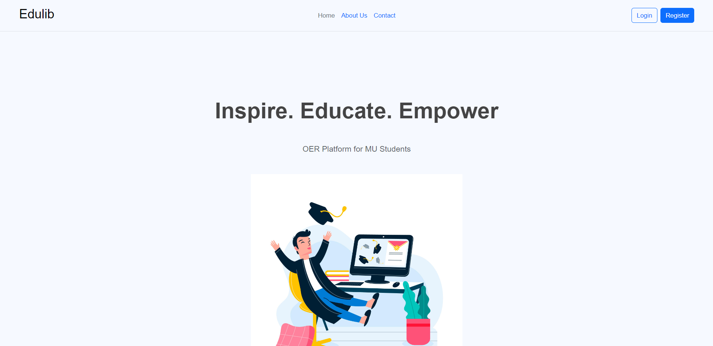
<h3 id = "login_header">Login</h3>
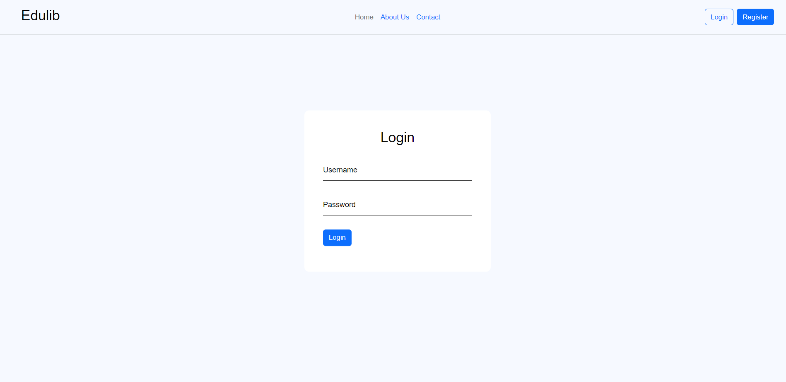
<h3 id = "user_reg_header">User Registration</h3>
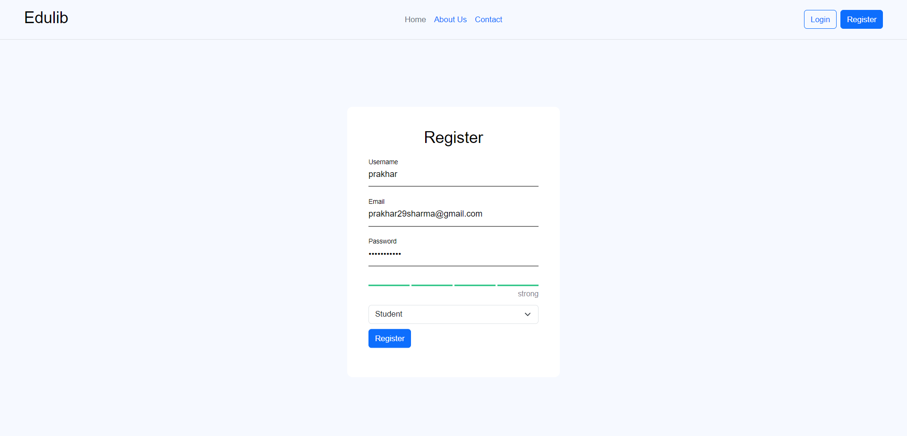
<h3 id = "dashobard_header">Admin</h3>
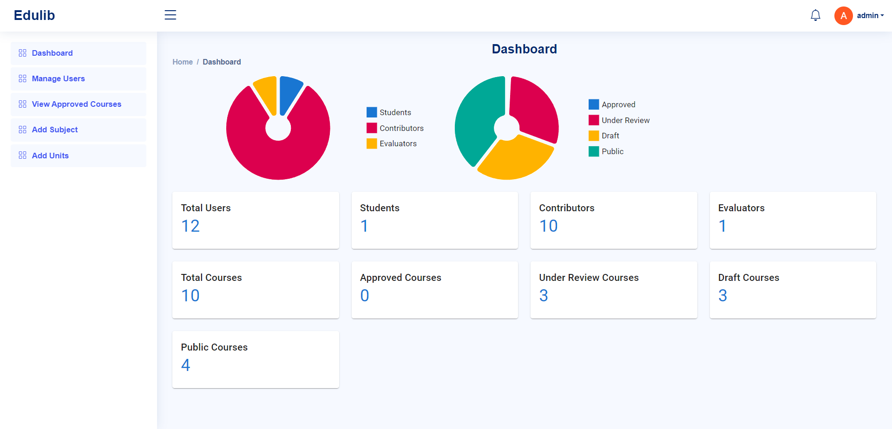
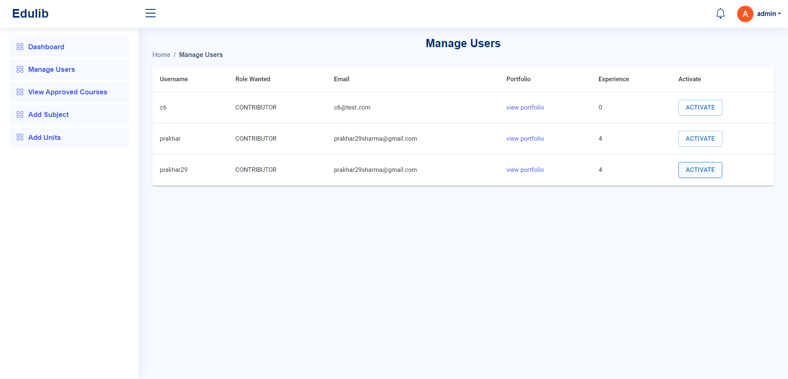
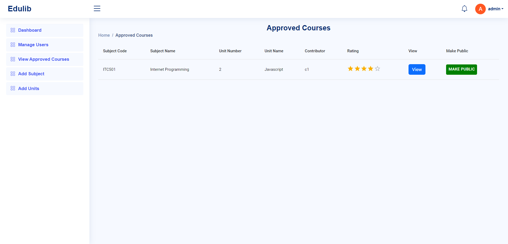
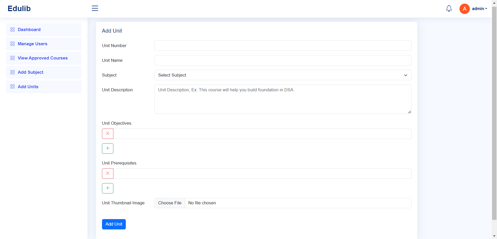
<h3 id = "contributor_header">Contributor</h3>
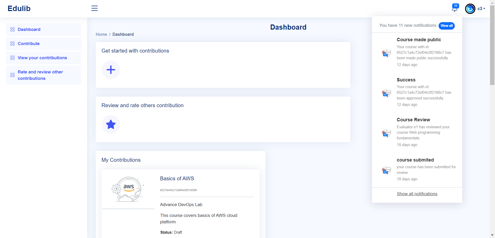
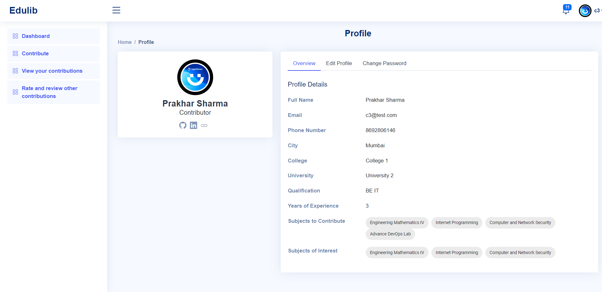

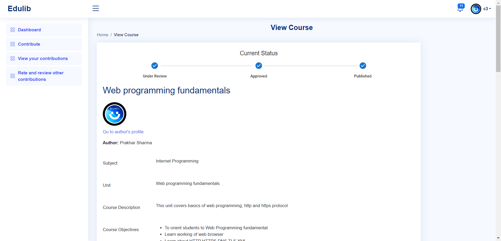
<h3 id="evaluator_header">Evaluator</h3>

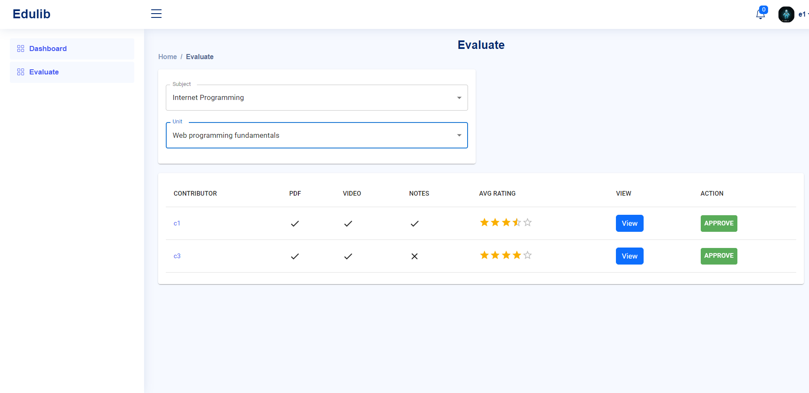
<h3 id="std_header">Student</h3>
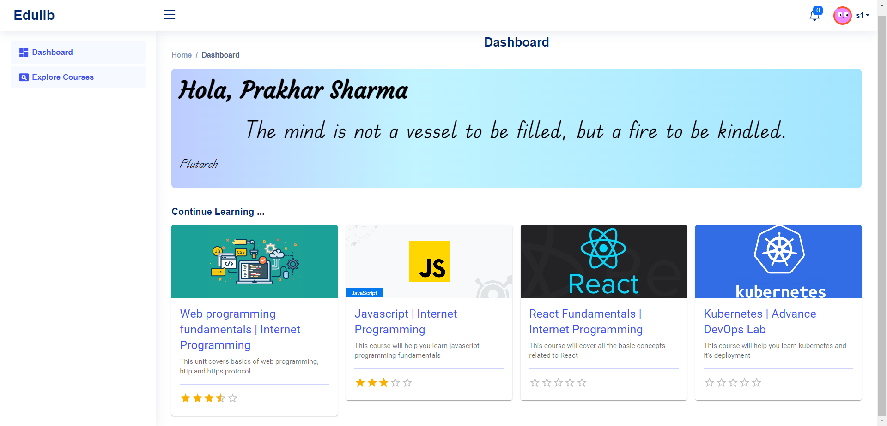

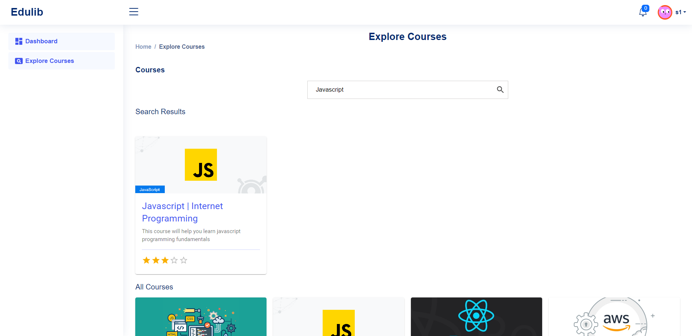
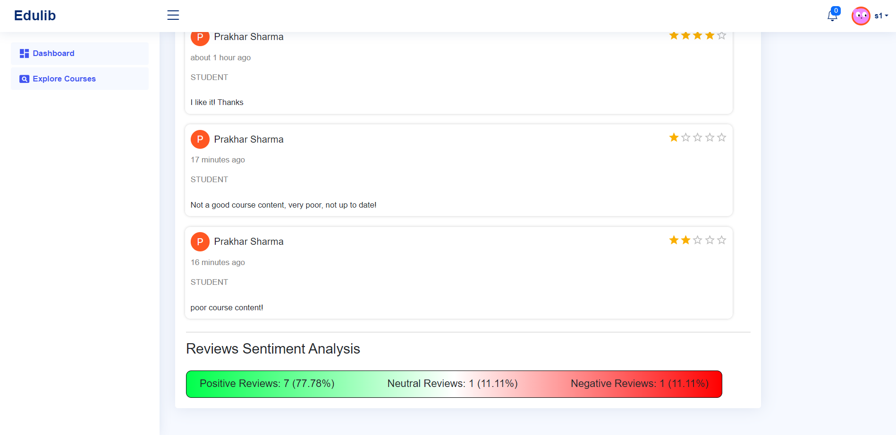

